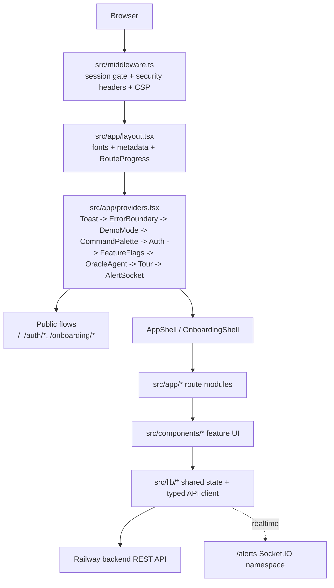

# Atlas Portal

Content-to-tweet crafting platform for crypto analysts. Atlas combines voice calibration, drafting, alerts, analytics, campaign planning, and internal ops tooling in a single Next.js frontend.

Built by [Delphi Digital](https://delphidigital.io).

## Stack

- **Framework:** Next.js 14 App Router, React 18, TypeScript 5
- **Styling:** Tailwind CSS 3.4 + design tokens in `src/lib/tokens.ts`
- **Motion:** Framer Motion 12
- **Auth:** `AuthProvider` in `src/lib/auth.tsx`, backed by the typed API client
- **API layer:** `src/lib/api.ts` namespaces all frontend-to-backend requests
- **Realtime:** Socket.IO alerts feed via `src/lib/alertSocket.tsx`
- **Testing:** Jest 30 + `@testing-library/react`
- **Monitoring:** Sentry
- **Deployment:** Vercel frontend, Railway backend

## Architecture

Atlas is a thin App Router frontend over a typed backend client. Session protection happens in two places: `src/middleware.ts` gates protected routes with the lightweight `atlas_session` cookie, and `src/components/layout/AppShell.tsx` re-checks `useAuth()` on the client before rendering the authenticated experience.



### Frontend layers

| Layer | Primary files | Responsibility |
|-------|---------------|----------------|
| Routing and security | `src/middleware.ts`, `src/app/layout.tsx`, `src/app/providers.tsx` | Global metadata, session redirects, CSP/security headers, and cross-app providers |
| Shells | `src/components/layout/AppShell.tsx`, `src/components/layout/OnboardingShell.tsx`, `src/components/ui/NavBar.tsx` | Shared chrome, navigation, protected layout, onboarding layout, lazy-loaded floating oracle |
| Route entrypoints | `src/app/**/page.tsx`, plus colocated `layout.tsx`, `loading.tsx`, `error.tsx` | Feature-specific pages and route-level boundaries |
| Feature UI | `src/components/alerts`, `analytics`, `crafting`, `onboarding`, `oracle`, `queue`, `voice-profiles`, `ui` | Reusable views and interaction surfaces for each product area |
| Shared services and state | `src/lib/api.ts`, `auth.tsx`, `feature-flags.tsx`, `oracle-agent.tsx`, `alertSocket.tsx`, `tour.ts` | Data access, auth/session, feature gating, oracle state, realtime alerts, guided tours |

### Key runtime behaviors

- **Auth and redirects:** middleware treats `/`, `/auth/*`, and `/onboarding/*` as public; everything else requires the session flag cookie. `AuthProvider` then hydrates the real user from the backend and handles refresh fallback.
- **Feature flags:** `src/lib/feature-flags.tsx` defines route-aware flags, feeds `FeatureGate`, and filters visible navigation links with `useRouteEnabled()`.
- **Oracle assistant:** `OracleAgentProvider` persists chat state in local storage, powers ambient UI narration, and backs the floating assistant plus page-level oracle widgets.
- **Realtime alerts:** `AlertSocketProvider` opens a Socket.IO connection to the backend `/alerts` namespace and drives unread notification state across the app shell.
- **Typed backend integration:** product pages call `api.auth`, `api.voice`, `api.drafts`, `api.analytics`, `api.alerts`, `api.briefing`, `api.research`, `api.oracle`, `api.featureFlags`, `api.campaigns`, and `api.queue` instead of ad hoc fetch calls.

## Route Map

| Group | Routes | Notes |
|-------|--------|-------|
| Public entry and onboarding | `/`, `/auth/callback`, `/auth/x/callback`, `/onboarding`, `/onboarding/track-a`, `/onboarding/track-b`, `/onboarding/handoff` | Sign-in, X auth callbacks, and track-based onboarding |
| Core analyst workflow | `/dashboard`, `/crafting`, `/voice-profiles`, `/voice-lab`, `/analytics`, `/alerts`, `/arena`, `/feed`, `/briefing` | Daily writing, voice calibration, performance review, alerts, and market context |
| Planning and distribution | `/campaigns`, `/campaigns/[id]`, `/campaigns/wizard`, `/queue`, `/telegram` | Campaign management, scheduling, queue control, and Telegram delivery |
| Team and account surfaces | `/team-library`, `/management`, `/profile`, `/search`, `/roadmap` | Shared resources, account settings, internal discovery, and roadmap views |
| Internal ops | `/admin`, `/admin/control`, `/admin/dashboard`, `/admin/flags`, `/admin/prompts`, `/admin/qa`, `/admin/bugs`, `/admin/roadmap`, `/admin/style-tile` | Feature flags, QA, prompt inspection, design system references, and admin tooling |

## Directory Map

```text
src/
  app/           route entrypoints and route-level boundaries
  components/    layout shells, shared UI, and feature-specific views
  hooks/         focused React hooks used by feature pages
  lib/           API client, auth, feature flags, oracle state, sockets, tours
  __tests__/     app, component, and lib tests mirroring the source tree
```

## Development

```bash
npm install
npm run dev
npm run build
npm run lint
npm test
```

## Environments

| Env | Frontend | Backend |
|-----|----------|---------|
| Production | https://delphi-atlas.vercel.app | https://api-production-9bef.up.railway.app |
| Staging | https://staging-delphi-atlas.vercel.app | https://api-staging-287d.up.railway.app |

## Branching

- `main` -> production
- `staging` -> integration and pre-production validation
- Open changes against `staging`, not `main`
- Codex branches should use `codex/{description}`

## Coding Standards

- All colors from `src/lib/tokens.ts` - never hardcode hex values
- One component per file
- Use `src/lib/api.ts` for backend calls - do not add raw fetches
- Auth state lives in `src/lib/auth.tsx`
- Glass cards use `bg-glass backdrop-blur-xl border border-glass-border rounded-2xl`
- Headings use `font-heading`; body copy uses `font-body`
- Prefer server components; add `'use client'` only where needed

## Related

- **Backend:** [atlas-backend](https://github.com/a13xperi/atlas-backend) - Express + Prisma + PostgreSQL
- **Figma:** File key `XYp41bfZdl8O00QCJqAdaK`
- **Contributor guidance:** `AGENTS.md` and `CLAUDE.md`
